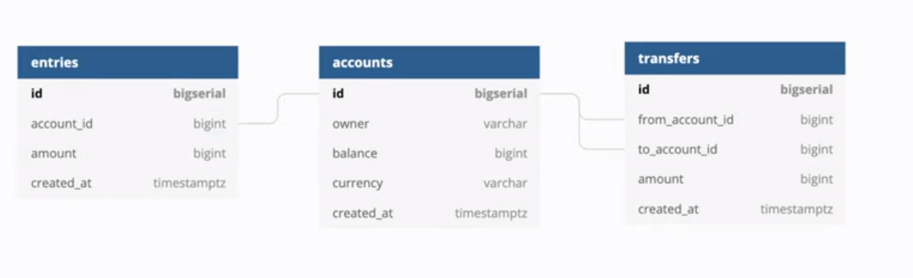

# A Bank
A bank to create and manage account (owner, balance, currency) and Record all balances changes,
Money transfer transaction (Perform money transfer between 2 account consistently within a transaction)

### Database diagram - UML

TODO:

- [ ] make DockerFile & docker-compose
- [x] use PostgresSQL
- [x] Implement CRUD transaction services
- [x] Fix DB transaction lock and handle deadlock issue
- [ ] use gRPC
- [x] Setup GitHub action
- [x] Implement user login with JWT access token
- [ ] Add factory & seeder
- [ ] Add API documentation
- [ ] Add middleware
- [ ] use k8s
